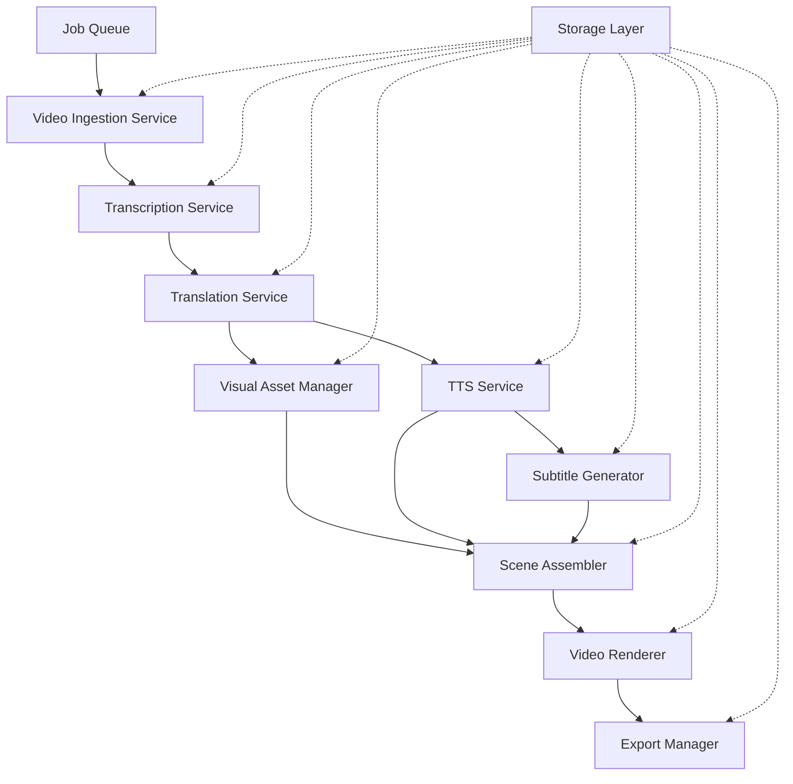

# Design Document: Multilingual Video Pipeline

## Overview

The Multilingual Video Pipeline is a Python-based automated system that transforms educational and storytelling videos from YouTube into multilingual versions with replaced visuals and emotional female narration. The system follows a modular architecture with distinct stages: ingestion, transcription, translation, visual generation, audio synthesis, video assembly, and export.

The pipeline processes videos through the following workflow:
1. **Ingestion**: Download videos and extract metadata using yt-dlp
2. **Transcription**: Extract speech-to-text using Whisper, for Vietnamese use PhoWhisper
3. **Translation**: Translate scripts to target languages using Tencent HY-MT1.5-1.8B-GPTQ-Int4 model
4. **Visual Generation**: Source and prepare replacement images, generate animations
5. **Audio Synthesis**: Generate emotional female narration using F5-TTS
6. **Subtitle Generation**: Create time-synchronized subtitles from audio using Whisper
7. **Scene Assembly**: Align visuals with narration timing
8. **Video Export**: Render final videos in multiple formats
    
## Architecture

### System Components



### Technology Stack

- **Video Processing**: FFmpeg (primary), MoviePy (Python wrapper)
- **Speech Recognition**: OpenAI Whisper (multilingual transcription), PhoWhisper for Vietnamese
- **Translation**: Tencent HY-MT1.5-1.8B-GPTQ-Int4 model
- **Text-to-Speech**: F5-TTS (emotional multilingual voice synthesis)
- **Image Processing**: Pillow (PIL) for image manipulation
- **Video Download**: yt-dlp (YouTube video ingestion)
- **Subtitle Generation**: Whisper-based from narration audio (auto-subtitle/custom as fallback)
- **Job Management**: Python asyncio with concurrent processing

**Can reuse exisiting local workflow, projects**

### Design Principles

1. **Modularity**: Each processing stage is independent and can be tested/replaced separately
2. **Fault Tolerance**: Failed jobs are retried with exponential backoff; system state is persisted
3. **Scalability**: Concurrent processing with configurable worker pools
4. **Quality First**: Multiple validation checkpoints ensure output meets quality standards
5. **Storage Efficiency**: Intermediate artifacts are cached but cleaned up after successful completion
6. **Maintainability**: Codebase is readable, modular and easy to extend, refactor

## Components and Interfaces


### 1. Video Ingestion Service

**Responsibility**: Download videos from YouTube channels and extract metadata

**Interface**:
```python
class VideoIngestionService:
    def fetch_channel_videos(channel_url: str, since: datetime = None, limit: int = None) -> List[VideoMetadata]
    def download_video(video_id: str, output_path: str) -> VideoFile
    def extract_metadata(video_id: str) -> VideoMetadata
    def extract_audio(video_file: VideoFile) -> AudioFile
```

**Implementation Details**:
- Uses yt-dlp Python library for robust YouTube downloading
- Supports manual fetching of videos from YouTube channels with optional date filtering
- Supports processing at least 10 YouTube channels simultaneously
- Extracts metadata including title, description, duration, upload date, and channel info
- Downloads video in highest quality available
- Separates audio track for transcription processing
- Implements rate limiting to respect YouTube's API limits
- Stores raw video files and metadata in structured storage

**Design Rationale**: Manual video selection allows for targeted processing of specific content without the complexity of automated monitoring. Users can specify which videos to process from each channel.

**Key Technologies**: yt-dlp, FFmpeg

### 2. Transcription Service

**Responsibility**: Convert audio to text using speech recognition with specialized Vietnamese support

**Interface**:
```python
class TranscriptionService:
    def transcribe_audio(audio_file: AudioFile, language: str = "auto") -> Transcript
    def detect_language(audio_file: AudioFile) -> str
    def segment_by_sentences(transcript: Transcript) -> List[TranscriptSegment]
    def select_transcription_model(language: str) -> TranscriptionModel
    def transcribe_vietnamese(audio_file: AudioFile) -> Transcript
    def transcribe_multilingual(audio_file: AudioFile, language: str) -> Transcript
```

**Implementation Details**:
- **Dual Model Architecture**: Uses specialized models based on detected language:
  - **PhoWhisper**: Optimized for Vietnamese speech recognition with superior accuracy for Vietnamese phonetics, tones, and dialects
  - **OpenAI Whisper**: For all other languages (Japanese, German, English) with robust multilingual support
- **Language Detection and Routing**:
  - Automatic language detection using Whisper's built-in detection
  - Routes Vietnamese audio to PhoWhisper for enhanced accuracy
  - Routes other languages to appropriate Whisper models
  - Fallback mechanism: if PhoWhisper fails, falls back to Whisper for Vietnamese
- **Vietnamese-Specific Features**:
  - Handles Vietnamese tonal variations and regional accents
  - Processes Vietnamese-specific phonetic patterns
  - Supports mixed Vietnamese-English code-switching common in modern Vietnamese content
  - Optimized for Vietnamese storytelling and educational content
- **Universal Features**:
  - Generates word-level timestamps for precise alignment across all languages
  - Segments transcript into logical sentences/phrases for scene boundaries
  - Handles multiple speakers if present in source audio
  - Confidence scoring for quality assessment
  - Outputs structured transcript with timing information
- **Performance Optimization**:
  - Uses faster-whisper for improved OpenAI Whisper performance
  - Implements model caching to avoid repeated loading
  - Supports batch processing for multiple audio files
  - GPU acceleration when available

**Key Technologies**: PhoWhisper (Vietnamese), OpenAI Whisper (multilingual), faster-whisper (optimization)

### 3. Translation Service

**Responsibility**: Translate scripts to target languages while preserving tone and timing

**Interface**:
```python
class TranslationService:
    def translate_script(transcript: Transcript, target_lang: str) -> TranslatedScript
    def validate_duration(original: Transcript, translated: TranslatedScript) -> bool
    def adjust_for_narration(script: TranslatedScript) -> TranslatedScript
    def assess_quality(translated: TranslatedScript) -> float
```

**Implementation Details**:
- Uses Tencent HY-MT1.5-1.8B-GPTQ-Int4 model translation
- Explicitly preserves storytelling tone, emotional context, and narrative pacing through specialized prompts
- Validates that translated text duration is within 20% of original (0.8 to 1.2 ratio)
- Adjusts phrasing to maintain natural speech patterns and emotional delivery
- Implements quality scoring based on fluency, coherence, and tone preservation
- Flags translations below quality threshold for manual review
- Handles cultural adaptation where necessary while maintaining original intent
- Supports Vietnamese, Japanese, German, and English

**Design Rationale**: The quality assessment mechanism ensures translations maintain the storytelling quality essential for educational and narrative content. Duration validation prevents timing mismatches that would disrupt scene alignment.

**Key Technologies**: Tencent HY-MT1.5-1.8B-GPTQ-Int4 model, custom prompt engineering

### 4. Visual Asset Manager

**Responsibility**: Source, prepare, and manage replacement images, add animations

**Interface**:
```python
class VisualAssetManager:
    def search_images(query: str, count: int) -> List[ImageAsset]
    def download_image(image_url: str) -> ImageFile
    def prepare_image(image: ImageFile, target_resolution: Resolution) -> ProcessedImage
    def match_images_to_scenes(scenes: List[Scene], context: str) -> Dict[Scene, ImageAsset]
```

**Implementation Details**:
- Integrates with Bing Image Search via `bing-image-downloader`; planned integrations include Google Images, Civitai, and Kling
- Uses content-based search to find contextually relevant images
- Resizes and crops images to target resolution (minimum 1080p)
- Applies consistent color grading and filters for visual coherence
- Caches downloaded images to avoid redundant downloads
- Implements fallback strategies if primary source fails

**Current Implementation**:
- Workflow: Origin video's text → Ollama summarization (`deepseek-r1:8b`) → Bing image search → Image download
- Query construction: uses the full summary as the search query; currently appends the phrase "latest, up to date information"
- This script provides functional search and download; integration with the `VisualAssetManager` class, caching policies, minimum-resolution enforcement, and multi-source fallbacks are planned

**Key Technologies**: Pillow (PIL), requests, bing-image-downloader, Ollama, custom image search APIs

### 5. TTS Service

**Responsibility**: Generate emotional female narration from translated scripts

**Interface**:
```python
class TTSService:
    def synthesize_speech(text: str, language: str, voice_profile: VoiceProfile) -> AudioFile
    def get_voice_profile(gender: str, style: str) -> VoiceProfile
    def adjust_prosody(audio: AudioFile, emotion: str) -> AudioFile
    def normalize_audio(audio: AudioFile, target_lufs: float = -16.0) -> AudioFile
```

**Implementation Details**:
- Uses F5-TTS for high-quality multilingual speech synthesis
- Configures female voice with emotional, storytelling characteristics
- Supports zero-shot voice cloning for consistent voice across languages
- Applies prosody adjustments for natural pacing and intonation
- Normalizes audio to -16 LUFS for consistent loudness
- Removes excessive silence while preserving natural pauses
- Exports audio in high-quality format (48kHz, 24-bit)

**Key Technologies**: F5-TTS, pydub for audio processing


### 6. Subtitle Generator

**Responsibility**: Create time-synchronized subtitles from audio using Whisper (primary) for all languages

**Interface**:
```python
class SubtitleGenerator:
    def generate_subtitles_from_audio(audio: AudioFile, language: str) -> SubtitleTrack
    def format_subtitles(subtitles: SubtitleTrack, style: SubtitleStyle) -> SubtitleTrack
    def embed_subtitles(video: VideoFile, subtitles: SubtitleTrack) -> VideoFile
```

**Implementation Details**:
- Uses Whisper to extract word-level timing directly from narration audio for subtitle alignment
- Generates subtitles with automatic synchronization (maximum 100ms offset)
- Formats text with appropriate line breaks (max 2 lines, 42 characters per line) respecting punctuation boundaries
- Applies styling for readability (white text, black outline, bottom positioning)
- Supports both embedded subtitles and .srt export
- Requires successful Whisper-based word-level timing extraction from audio; no text-derived fallback timing

**Key Technologies**: Whisper, auto-subtitle, pysrt, moviePy for embedding

### 7. Scene Assembler

**Responsibility**: Align visuals with narration timing and create video scenes

**Interface**:
```python
class SceneAssembler:
    def create_scenes(transcript: TranslatedScript, images: Dict[Scene, ImageAsset]) -> List[VideoScene]
    def align_timing(scene: VideoScene, audio: AudioFile) -> VideoScene
    def apply_transitions(scenes: List[VideoScene], transition_type: str = "fade") -> List[VideoScene]
    def add_effects(scene: VideoScene, effects: List[Effect]) -> VideoScene
```

**Implementation Details**:
- Segments video into scenes based on transcript timing
- Aligns each image with corresponding narration segment
- Applies smooth transitions (fade, crossfade) between scenes (minimum 0.5s)
- Supports ken burns effect for static images (subtle zoom/pan)
- Handles scene duration to match audio length
- Maintains consistent frame rate (30fps or 60fps)

**Key Technologies**: MoviePy, FFmpeg

### 8. Video Renderer

**Responsibility**: Render final videos with all components assembled

**Interface**:
```python
class VideoRenderer:
    def render_video(scenes: List[VideoScene], audio: AudioFile, subtitles: SubtitleTrack, format: OutputFormat) -> VideoFile
    def set_resolution(width: int, height: int) -> None
    def set_codec(video_codec: str, audio_codec: str) -> None
    def optimize_for_platform(platform: str) -> RenderSettings
```

**Implementation Details**:
- Combines scenes, audio, and subtitles into final video
- Supports multiple output formats (horizontal 16:9, vertical 9:16)
- Uses H.264 codec for maximum platform compatibility
- Applies platform-specific optimizations (YouTube, TikTok, Facebook)
- Renders at appropriate resolution (1080p minimum for horizontal, 1080x1920 for vertical)
- Implements two-pass encoding for optimal quality/size ratio
- Validates output quality before marking as complete

**Key Technologies**: FFmpeg (primary), MoviePy for high-level orchestration

### 9. Export Manager

**Responsibility**: Manage final exports and platform-specific formatting

**Interface**:
```python
class ExportManager:
    def export_video(video: VideoFile, format: OutputFormat, platform: str) -> ExportedVideo
    def generate_metadata(video: VideoFile, original_metadata: VideoMetadata) -> VideoMetadata
    def create_thumbnail(video: VideoFile, timestamp: float) -> ImageFile
    def package_outputs(videos: List[ExportedVideo]) -> ExportPackage
```

**Implementation Details**:
- Exports videos in platform-ready formats
- Generates appropriate metadata for each platform
- Creates thumbnails from key frames
- Packages all language versions together
- Implements file naming conventions for easy organization
- Validates exports meet platform requirements

**Key Technologies**: FFmpeg, custom metadata handling

### 10. Job Queue and Orchestrator

**Responsibility**: Manage processing pipeline and coordinate services

**Interface**:
```python
class JobOrchestrator:
    def submit_job(video_id: str, channels: List[str]) -> JobID
    def process_job(job_id: JobID) -> JobResult
    def retry_failed_job(job_id: JobID) -> JobResult
    def get_job_status(job_id: JobID) -> JobStatus
    def cancel_job(job_id: JobID) -> bool
```

**Implementation Details**:
- Manages job queue with priority scheduling
- Coordinates all services in correct sequence
- Implements retry logic with exponential backoff (max 3 retries)
- Persists job state for recovery after failures
- Supports concurrent processing (configurable worker pool)
- Provides progress tracking and status updates
- Handles cleanup of intermediate files after successful completion

**Key Technologies**: Python asyncio, Redis or SQLite for job state


## Data Models

### VideoMetadata
```python
@dataclass
class VideoMetadata:
    video_id: str
    title: str
    description: str
    duration: float  # seconds
    upload_date: datetime
    channel_name: str
    channel_url: str
    original_language: str
    tags: List[str]
```

### TranscriptionModel
```python
from enum import Enum

class TranscriptionModel(Enum):
    PHOWHISPER = "phowhisper"  # Vietnamese-optimized model
    WHISPER_MULTILINGUAL = "whisper_multilingual"  # OpenAI Whisper for other languages
    WHISPER_FALLBACK = "whisper_fallback"  # Fallback for Vietnamese if PhoWhisper fails
```

### Transcript
```python
@dataclass
class TranscriptSegment:
    text: str
    start_time: float  # seconds
    end_time: float
    confidence: float
    
@dataclass
class Transcript:
    segments: List[TranscriptSegment]
    language: str
    full_text: str
    transcription_model: TranscriptionModel  # Which model was used
    model_confidence: float  # Overall transcription confidence
```

### TranslatedScript
```python
@dataclass
class TranslatedScript:
    original: Transcript
    translated_segments: List[TranscriptSegment]
    target_language: str
    duration_ratio: float  # translated_duration / original_duration
```

### Scene
```python
@dataclass
class Scene:
    scene_id: str
    transcript_segment: TranscriptSegment
    image_asset: Optional[ImageAsset]
    audio_segment: Optional[AudioFile]
    duration: float
    transition_type: str = "fade"
```

### OutputFormat
```python
@dataclass
class OutputFormat:
    language: str
    aspect_ratio: str  # "16:9" or "9:16"
    resolution: Tuple[int, int]  # (width, height)
    platform: str  # "youtube", "tiktok", "facebook"
```

### JobStatus
```python
@dataclass
class JobStatus:
    job_id: str
    video_id: str
    status: str  # "queued", "processing", "completed", "failed"
    current_stage: str
    progress: float  # 0.0 to 1.0
    error_message: Optional[str]
    retry_count: int
    created_at: datetime
    updated_at: datetime
```

## Correctness Properties

*A property is a characteristic or behavior that should hold true across all valid executions of a system—essentially, a formal statement about what the system should do. Properties serve as the bridge between human-readable specifications and machine-verifiable correctness guarantees.*


### Property 1: Complete Metadata Extraction

*For any* ingested video, the extracted metadata should contain all required fields: title, description, duration, upload date, and channel information.

**Validates: Requirements 1.2, 1.4**

### Property 2: Error Handling Continuity

*For any* unavailable or restricted video, the pipeline should log the error and continue processing subsequent videos without interruption.

**Validates: Requirements 1.3**

### Property 3: Transcript Generation Completeness

*For any* video with audio content, the transcription service should produce a complete text script with timing information.

**Validates: Requirements 2.1**

### Property 4: Multilingual Translation Coverage

*For any* extracted transcript, the translation service should produce translations in all four target languages: Vietnamese, Japanese, German, and English.

**Validates: Requirements 2.2**

### Property 5: Translation Duration Preservation

*For any* translated script, the duration ratio (translated_duration / original_duration) should be within 0.8 to 1.2 (20% variance).

**Validates: Requirements 2.4**

### Property 6: Quality-Based Flagging

*For any* translation with quality score below the acceptable threshold, the pipeline should flag the video for manual review.

**Validates: Requirements 2.5**

### Property 7: Visual Replacement Completeness

*For any* processed video, all frames should contain only new visual assets with no original video frames remaining.

**Validates: Requirements 3.1**

### Property 8: Image Source Validation

*For any* visual asset used in the pipeline, the source should be one of the approved providers: Google Images, Civitai, or Kling.

**Validates: Requirements 3.2**

### Property 9: Minimum Resolution Compliance

*For any* output video in horizontal format, the resolution should be at least 1080p (1920x1080 or higher).

**Validates: Requirements 3.4, 5.5, 10.1**

### Property 10: Transition Duration Compliance

*For any* pair of consecutive scenes in a video, the transition between them should be at least 0.5 seconds in duration.

**Validates: Requirements 3.5**

### Property 11: Audio Generation Completeness

*For any* translated script, the TTS engine should generate corresponding audio narration.

**Validates: Requirements 4.1**

### Property 12: Audio Loudness Normalization

*For any* generated audio output, the measured loudness should be -16 LUFS (±0.5 LUFS tolerance).

**Validates: Requirements 4.4, 8.1**

### Property 13: No Audio Clipping

*For any* generated or processed audio, the peak level should not exceed -1 dBFS (no clipping).

**Validates: Requirements 4.5, 8.3**

### Property 14: Language Output Completeness

*For any* processed video, the pipeline should generate exactly 4 output videos, one for each target language.

**Validates: Requirements 5.1**

### Property 15: Horizontal Format Consistency

*For any* output video, the horizontal format version should have a 16:9 aspect ratio.

**Validates: Requirements 5.2**

### Property 16: Vietnamese Vertical Format

*For any* processed video, only the Vietnamese language version should have a vertical (9:16) format output, and other languages should not.

**Validates: Requirements 5.3**

### Property 17: Subtitle Language Matching

*For any* output video, the subtitle track language should match the audio narration language.

**Validates: Requirements 6.1**

### Property 18: Subtitle Synchronization Accuracy

*For any* subtitle segment, the timing offset from the corresponding audio should not exceed 100ms.

**Validates: Requirements 6.2, 10.4**

### Property 19: Subtitle Export Completeness

*For any* generated video, subtitles should be both embedded in the video file and exported as a separate .srt file.

**Validates: Requirements 6.4**

### Property 20: Scene Segmentation Alignment

*For any* processed video, the number of scenes should match the number of transcript segments.

**Validates: Requirements 7.1**

### Property 21: Scene Duration Matching

*For any* scene, the visual duration should match the audio narration duration for that scene (within 100ms tolerance).

**Validates: Requirements 7.2**

### Property 22: Consecutive Scene Transitions

*For any* video with multiple scenes, transitions should exist between all consecutive scene pairs.

**Validates: Requirements 7.3**

### Property 23: Consistent Frame Pacing

*For any* video, the variance in frame duration should be below a threshold indicating no abrupt timing changes.

**Validates: Requirements 7.4**

### Property 24: Lip Sync When Applicable

*For any* scene containing character visuals with facial features, the visual mouth movements should be synchronized with the audio speech.

**Validates: Requirements 7.5**

### Property 25: Silence Gap Removal

*For any* generated audio narration, no silence gap should exceed 2 seconds in duration.

**Validates: Requirements 8.2**

### Property 26: Audio Format Compliance

*For any* exported video, the audio track should use AAC codec at 192 kbps bitrate.

**Validates: Requirements 8.4**

### Property 27: Audio Ducking When Music Present

*For any* video with background music, the music volume should be reduced (ducked) during narration segments compared to non-narration segments.

**Validates: Requirements 8.5**

### Property 28: Retry Limit Enforcement

*For any* failed processing job, the retry count should not exceed 3 attempts before marking as permanently failed.

**Validates: Requirements 9.2, 12.2**

### Property 29: Queue Priority Ordering

*For any* processing queue state, videos should be ordered by upload date with newer videos having higher priority.

**Validates: Requirements 9.3**

### Property 30: Processing Log Completeness

*For any* processed video, the log should contain entries with start time, completion time, and any error messages.

**Validates: Requirements 9.4**

### Property 31: Batch Summary Generation

*For any* completed batch of videos, a summary report should be generated containing statistics for all videos in the batch.

**Validates: Requirements 9.5**

### Property 32: Audio Level Validation Range

*For any* output video, the audio loudness should be within the acceptable range of -20 LUFS to -12 LUFS.

**Validates: Requirements 10.2**

### Property 33: Validation Error Flagging

*For any* video that fails validation checks, the video should be flagged with specific error details describing the validation failures.

**Validates: Requirements 10.3**

### Property 34: Output Format Completeness

*For any* video marked as complete, all required output formats (4 horizontal + 1 vertical Vietnamese) should exist.

**Validates: Requirements 10.5**

### Property 35: Video Codec Standardization

*For any* exported video, the video codec should be H.264 for platform compatibility.

**Validates: Requirements 11.1**

### Property 36: YouTube Export Specifications

*For any* video exported for YouTube, the aspect ratio should be 16:9 and resolution should be at least 1080p.

**Validates: Requirements 11.2**

### Property 37: TikTok Export Specifications

*For any* video exported for TikTok, the aspect ratio should be 9:16 and resolution should be exactly 1080x1920.

**Validates: Requirements 11.3**

### Property 38: Facebook Reels Export Specifications

*For any* video exported for Facebook Reels, the aspect ratio should be 9:16.

**Validates: Requirements 11.4**

### Property 39: Platform Metadata Embedding

*For any* exported video, platform-appropriate metadata tags should be embedded in the video file.

**Validates: Requirements 11.5**

### Property 40: Error Logging Completeness

*For any* processing step failure, the error log should contain detailed information including error message and stack trace.

**Validates: Requirements 12.1**

### Property 41: Failed Video Queue Management

*For any* video that fails after maximum retries, the video should be moved to the failed queue and processing should continue with remaining videos.

**Validates: Requirements 12.3**

### Property 42: Critical Failure Notifications

*For any* critical failure requiring manual intervention, a notification should be sent to the system administrator.

**Validates: Requirements 12.4**

### Property 43: State Persistence and Recovery

*For any* processing job interrupted by system restart, the job state should be recoverable allowing resumption from the last completed stage.

**Validates: Requirements 12.5**


## Error Handling

### Error Categories

1. **Transient Errors**: Network timeouts, temporary API unavailability, rate limiting
   - Strategy: Retry with exponential backoff (max 3 attempts)
   - Examples: YouTube download failures, image source timeouts

2. **Permanent Errors**: Invalid video IDs, copyright restrictions, unsupported formats
   - Strategy: Log error, move to failed queue, continue processing
   - Examples: Deleted videos, region-locked content

3. **Quality Errors**: Translation quality below threshold, audio clipping, resolution issues
   - Strategy: Flag for manual review, optionally retry with different parameters
   - Examples: Poor translation quality, audio distortion

4. **System Errors**: Out of memory, disk space exhausted, service crashes
   - Strategy: Send critical notifications, persist state, attempt graceful shutdown
   - Examples: Disk full during rendering, OOM during video processing

### Error Recovery Mechanisms

**Job State Persistence**:
- All job states are persisted to durable storage (Redis/SQLite)
- State includes: current stage, processed artifacts, retry count, error history
- Enables resumption after system restarts or crashes

**Retry Logic**:
- Exponential backoff: 1s, 2s, 4s delays between retries
- Maximum 3 retry attempts per operation
- Different retry strategies for different error types

**Circuit Breaker Pattern**:
- If a service (e.g., image source) fails repeatedly, temporarily disable it
- Fallback to alternative services when available
- Automatic re-enablement after cooldown period

**Graceful Degradation**:
- If optional features fail (e.g., background music), continue without them
- Core functionality (transcription, translation, TTS) must succeed
- Partial outputs are better than complete failure

### Logging and Monitoring

**Structured Logging**:
- All operations logged with timestamps, job IDs, and context
- Log levels: DEBUG, INFO, WARNING, ERROR, CRITICAL
- Separate log files for different services

**Metrics Collection**:
- Processing time per stage
- Success/failure rates
- Queue depth and processing throughput
- Resource utilization (CPU, memory, disk)

**Alerting**:
- Critical failures trigger immediate notifications
- Threshold-based alerts for queue depth, error rates
- Daily summary reports of processing statistics

## Testing Strategy

### Dual Testing Approach

The system will employ both unit testing and property-based testing to ensure comprehensive coverage:

- **Unit tests**: Verify specific examples, edge cases, and error conditions
- **Property tests**: Verify universal properties across all inputs using randomized testing

Both testing approaches are complementary and necessary. Unit tests catch specific bugs and validate integration points, while property tests ensure correctness across the entire input space.

### Unit Testing

**Scope**:
- Individual service methods and functions
- Integration between services
- Error handling paths
- Edge cases (empty inputs, maximum sizes, special characters)

**Test Organization**:
- Co-located with source files using `_test.py` suffix
- Organized by service/component
- Use pytest framework for test execution

**Key Test Areas**:
1. Video ingestion: Test with various video formats, sizes, and metadata
2. Transcription: Test with different languages, audio qualities, and durations
3. Translation: Test with various text lengths and language pairs
4. TTS: Test voice generation across languages and text types
5. Scene assembly: Test with different scene counts and transition types
6. Subtitle generation: Test timing accuracy and formatting
7. Video rendering: Test multiple output formats and resolutions
8. Error handling: Test all error categories and recovery mechanisms

### Property-Based Testing

**Framework**: Hypothesis (Python property-based testing library)

**Configuration**:
- Minimum 100 iterations per property test
- Each test tagged with: `Feature: multilingual-video-pipeline, Property N: [property description]`
- Randomized input generation with smart constraints

**Property Test Implementation**:

Each of the 43 correctness properties defined above will be implemented as a property-based test. The tests will:

1. Generate random valid inputs (videos, transcripts, audio files, etc.)
2. Execute the relevant pipeline operations
3. Assert that the property holds for all generated inputs

**Example Property Test Structure**:
```python
from hypothesis import given, strategies as st

# Feature: multilingual-video-pipeline, Property 3: Transcript Generation Completeness
@given(audio_file=st.audio_files(min_duration=10, max_duration=600))
def test_transcript_completeness(audio_file):
    """For any video with audio, transcription should produce complete script"""
    transcript = transcription_service.transcribe_audio(audio_file)
    
    assert transcript is not None
    assert len(transcript.segments) > 0
    assert transcript.full_text != ""
    assert all(seg.start_time < seg.end_time for seg in transcript.segments)
```

**Smart Generators**:
- Custom Hypothesis strategies for domain objects (VideoMetadata, Transcript, etc.)
- Constrained generation to produce valid inputs (e.g., positive durations, valid resolutions)
- Shrinking support to find minimal failing examples

**Property Test Coverage**:
- All 43 properties will have corresponding property tests
- Tests will cover normal cases, edge cases, and boundary conditions
- Failed tests will provide counterexamples for debugging

### Integration Testing

**End-to-End Tests**:
- Process complete videos through entire pipeline
- Verify all outputs are generated correctly
- Test with representative sample videos from target channels

**Service Integration Tests**:
- Test interactions between adjacent services
- Verify data contracts and interfaces
- Test error propagation and handling

### Performance Testing

**Load Testing**:
- Test concurrent processing of multiple videos
- Verify system handles target throughput (5+ concurrent jobs)
- Measure resource utilization under load

**Benchmark Tests**:
- Measure processing time for standard video lengths
- Track performance regressions over time
- Optimize bottlenecks identified through profiling

### Test Data Management

**Test Fixtures**:
- Sample videos in various formats and languages
- Pre-generated transcripts and translations
- Reference outputs for validation

**Mock Services**:
- Mock external APIs (YouTube, image sources) for unit tests
- Use real services for integration and property tests
- Implement test doubles for expensive operations

### Continuous Testing

**CI/CD Integration**:
- All tests run on every commit
- Property tests run with reduced iteration count (20) in CI
- Full property test suite (100 iterations) runs nightly
- Integration tests run on staging environment before deployment

**Test Reporting**:
- Coverage reports for unit tests (target: 80%+ coverage)
- Property test results with counterexamples for failures
- Performance benchmarks tracked over time
